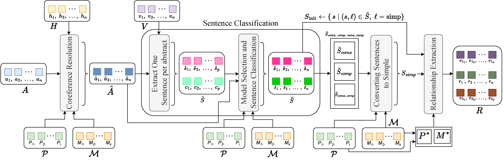

# CoDe-KG
This repository contains the source code and dataset for:

# Automated Knowledge Graph Construction using Large Language Models and Sentence Complexity Modelling

[Link to paper](https://arxiv.org/pdf/2509.17289v1)

## Abstract
We introduce CoDe-KG, an open-source, end-to-end pipeline for extracting sentence-level knowledge graphs by combining robust coreference resolution with syntactic sentence decomposition. Using our model, we contribute a dataset of over 150 000 knowledge triples, which is open source. We also contribute a training corpus of 7,248 rows for sentence complexity, 190 rows of gold human annotations for co-reference resolution using open source lung-cancer abstracts from PubMed, 900 rows of gold human annotations for sentence conversion policies, and 398 triples of gold human annotations. We systematically select optimal prompt-model pairs across five complexity categories, showing that hybrid chain of-thought and few-shot prompting yields up to 99.8% exact-match accuracy on sentence simplification. On relation extraction (RE), our pipeline achieves 65.8% macro-F1 on REBEL, an 8-point gain over the prior state of the art, and 75.7% micro-F1 on WebNLG2, while matching or exceeding performance on Wiki-NRE and CaRB. Ablation studies demonstrate that integrating coreference and decomposition increases recall on rare relations by over 20%.



# Dataset Structure

## Coreference Resolution Dataset

The dataset is provided in JSON format with the following structure:

```json
{
  "doc_id": "103",
  "annotations": [
    {
      "Expression": "PBC",
      "StartToken": 14,
      "EndToken": 14,
      "RefersTo": "Primary biliary cirrhosis"
    }
  ],
  "new_text": "(\"BACKGROUND:\", 0), (\"There\", 1), ..."
}
```

## Fields Description

* **`doc_id`**: Unique identifier for each document
* **`annotations`**: List of coreference annotations containing:
  * **`Expression`**: The text span that refers to an entity
  * **`StartToken`**: Starting token position (0-indexed)
  * **`EndToken`**: Ending token position (0-indexed, inclusive)
  * **`RefersTo`**: The entity or concept that the expression refers to
* **`new_text`**: Tokenized version of the original text with token positions

